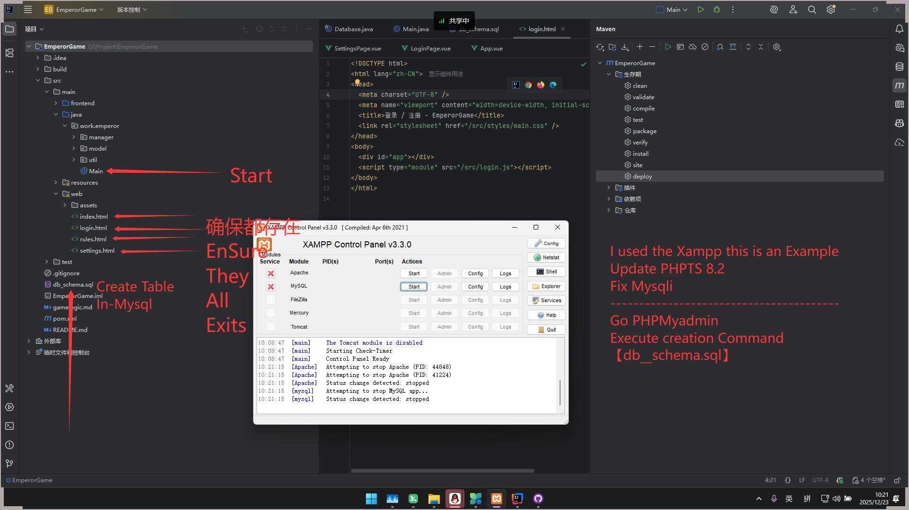
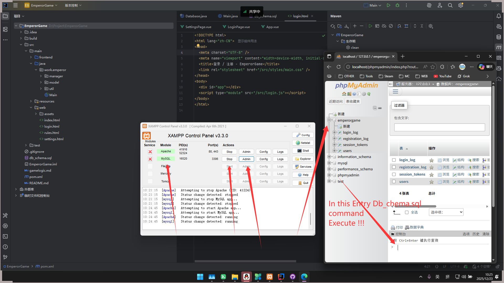
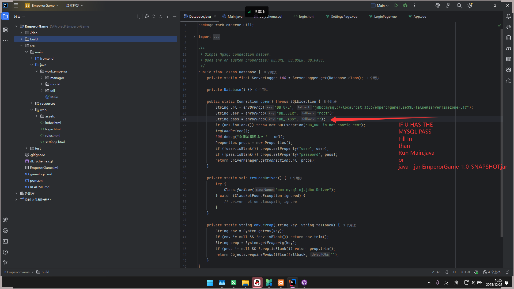
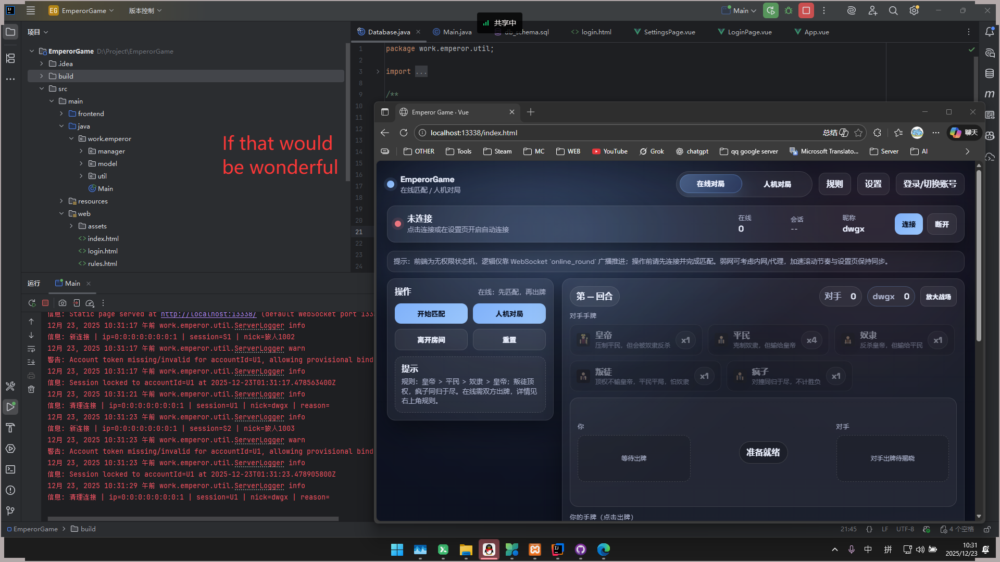
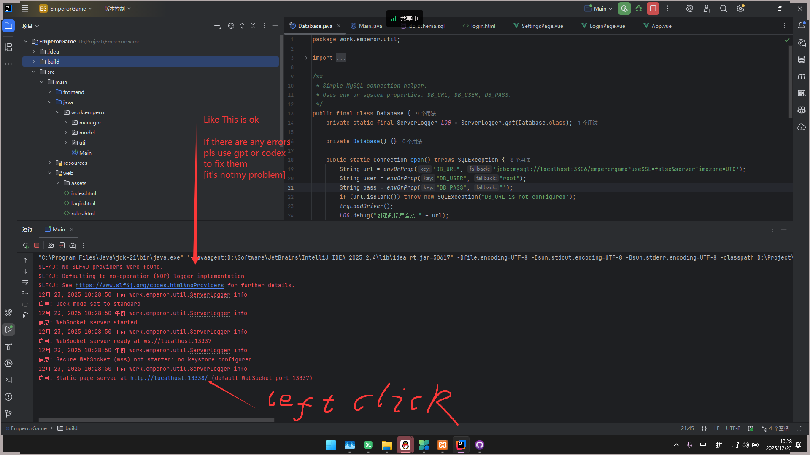

# EmperorGame 使用手册

## 项目简介
轻量级 WebSocket + HTTP 的卡牌对战示例。后端为单体 Java（内置静态资源服务），前端为预编译的静态页（`src/main/web`）。默认端口：WS `13337`，HTTP `13338`。

## 环境要求
- JDK 17+
- Maven 3.8+
- MySQL（或兼容服务），通过环境变量配置

## 构建与运行
```bash
mvn clean package
java -jar target/EmperorGame-1.0-SNAPSHOT-shaded.jar
# 自定义端口示例：
# WS_PORT=80 HTTP_PORT=81 java -jar target/EmperorGame-1.0-SNAPSHOT-shaded.jar
```
默认启动：
- WebSocket: ws://localhost:13337
- HTTP/静态/API: http://localhost:13338

## 数据库配置（环境变量/JVM 参数）
- `DB_URL` 例如 `jdbc:mysql://localhost:3306/emperorgame?useSSL=false&serverTimezone=UTC`
- `DB_USER`
- `DB_PASS`

启动会自动建表：`users` / `registration_log` / `login_log` / `session_tokens`

## API 一览（POST JSON）
- `/api/register` {nickname, password}
- `/api/login` {nickname, password}
- 返回：`{ ok: boolean, message: string, accountId?: string, token?: string }`

## 前端说明
- 预编译静态文件在 `src/main/web/`，可用内置 HTTP 服务或单独部署到 Nginx/Apache。
- 登录/注册成功后会缓存 `accountId` 与 `token` 到 localStorage；前端适配同域 `/api`，并带有多端点回退。
- WebSocket 地址按当前页面同域拼接：`ws(s)://<host>/ws/`，建议在反代层映射到后端 WS 端口。

## Nginx 反代示例（同域 HTTPS）
```nginx
server {
    listen 80;
    server_name japanese.icu;   # 改成你的域名/IP
    return 301 https://$host$request_uri;
}

server {
    listen 443 ssl http2;
    server_name japanese.icu;

    root /www/wwwroot/japanese.icu;
    index index.html;
    try_files $uri $uri/ /index.html;

    location /api/ {
        proxy_pass http://127.0.0.1:13338;
        proxy_set_header Host $host;
        proxy_set_header X-Real-IP $remote_addr;
        proxy_set_header X-Forwarded-For $proxy_add_x_forwarded_for;
        proxy_set_header X-Forwarded-Proto $scheme;
    }

    location /ws/ {
        proxy_pass http://127.0.0.1:13337/;
        proxy_http_version 1.1;
        proxy_set_header Upgrade $http_upgrade;
        proxy_set_header Connection "Upgrade";
        proxy_set_header Host $host;
        proxy_set_header X-Real-IP $remote_addr;
        proxy_set_header X-Forwarded-For $proxy_add_x_forwarded_for;
        proxy_set_header X-Forwarded-Proto $scheme;
    }
}
```

## 常见问题
- **Account token invalid or missing**：确认登录/注册成功且同域调用 `/api/login`，前端会缓存 token。
- **CORS/跨域**：后端默认回显 Origin 并允许 POST/OPTIONS；建议同域反代。
- **运行 JAR 提示无主清单**：使用 `target/EmperorGame-1.0-SNAPSHOT-shaded.jar`（shade 插件已配置）。

## 教程图示
- 
- 
- 
- 
- 
